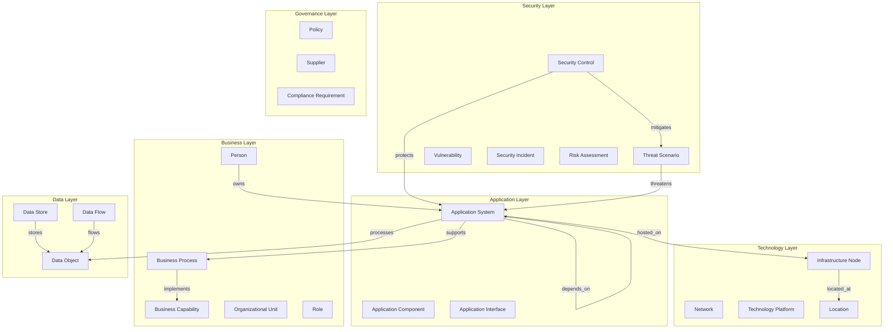
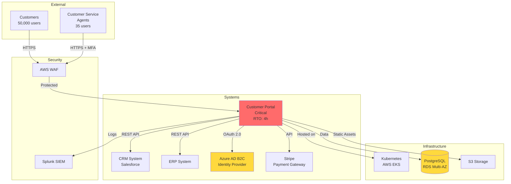
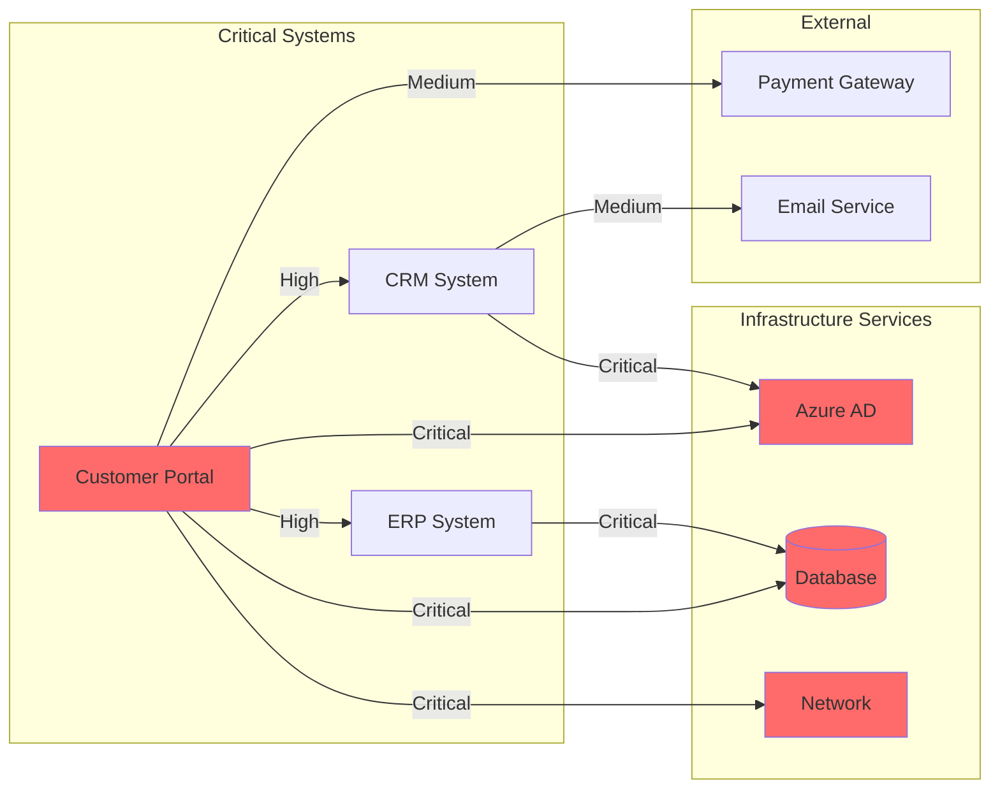
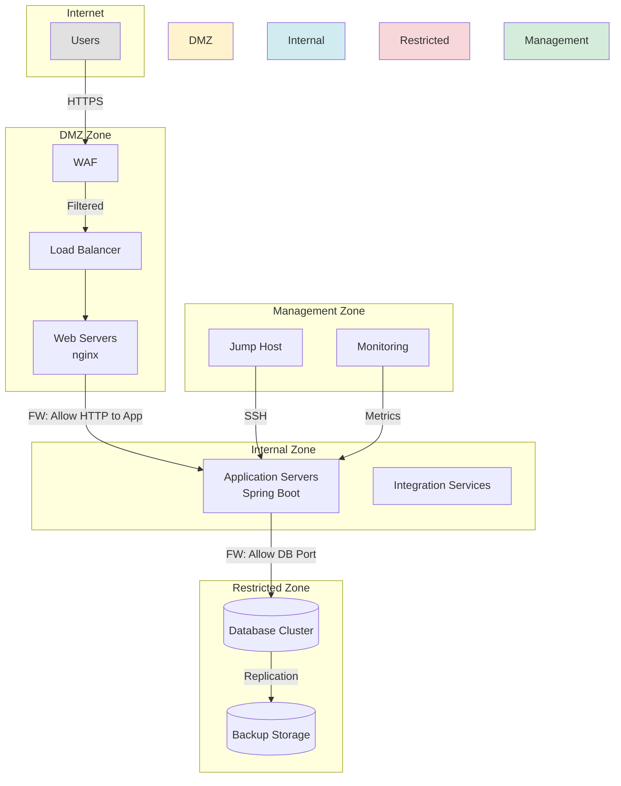
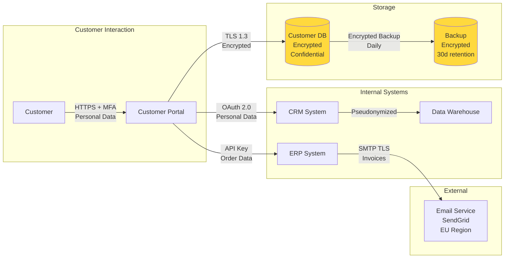
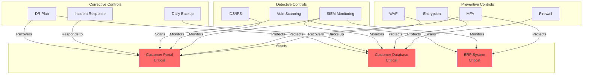

# Visualiseringsguide för NIS 2 EA Framework

## Översikt

Detta dokument beskriver hur metamodellen kan visualiseras för olika målgrupper och användningsfall.

## Verktyg för Visualisering

### Rekommenderade Verktyg

1. **Archi** (Gratis, Open Source)
   - Stödjer ArchiMate
   - Kan anpassas för custom metamodeller
   - Export till bilder, HTML, CSV
   - ✅ Bäst för: EA-team

2. **Draw.io / Diagrams.net** (Gratis)
   - Web-baserat eller desktop
   - Enkelt att dela
   - ✅ Bäst för: Enklare diagram

3. **Mermaid** (Gratis, kod-baserat)
   - Diagram som kod
   - Versionshanteras tillsammans med dokumentation
   - ✅ Bäst för: Tech-savvy teams, DevOps

4. **Microsoft Visio** (Kommersiellt)
   - Integrerat med Microsoft-ekosystemet
   - ✅ Bäst för: Microsoft-shops

5. **Sparx Enterprise Architect** (Kommersiellt)
   - Professionellt EA-verktyg
   - Fullt stöd för UML, ArchiMate, BPMN
   - ✅ Bäst för: Stora enterprise-organisationer

## Visualiseringstyper

### 1. Metamodell Overview

**Syfte**: Visa strukturen av metamodellen på hög nivå

**Målgrupp**: EA-team, Management, Auditors

**Exempel (Mermaid)**:


### 2. System Context Diagram

**Syfte**: Visa ett system i sitt sammanhang - användare, integrationer, infrastruktur

**Målgrupp**: System owners, Developers, Operations

**Exempel för Customer Portal**:


### 3. Dependency Map

**Syfte**: Visa beroenden mellan system

**Målgrupp**: IT Operations, Business Continuity Planning

**Exempel**:


### 4. Network Architecture Diagram

**Syfte**: Visa nätverkssegmentering och säkerhetszoner

**Målgrupp**: Network team, Security team, Auditors

**Exempel**:


### 5. Data Flow Diagram

**Syfte**: Visa dataflöden, särskilt när personuppgifter är involverade (GDPR)

**Målgrupp**: Data Protection Officer, Security team, Compliance

**Exempel - Customer Data**:


### 6. Security Control Coverage

**Syfte**: Visa vilka säkerhetskontroller som skyddar vilka tillgångar

**Målgrupp**: CISO, Security team, Auditors

**Exempel**:


### 7. Risk Heatmap

**Syfte**: Visualisera risker baserat på sannolikhet och påverkan

**Målgrupp**: Management, Risk Committee, CISO

**Visuell representation**:
```
Impact
  ↑
5 │     │     │     │  R3 │ R1  │
  │─────┼─────┼─────┼─────┼─────│
4 │     │     │     │  R4 │     │
  │─────┼─────┼─────┼─────┼─────│
3 │     │     │  R5 │     │     │
  │─────┼─────┼─────┼─────┼─────│
2 │     │  R6 │     │     │     │
  │─────┼─────┼─────┼─────┼─────│
1 │  R7 │     │     │     │     │
  └─────┴─────┴─────┴─────┴─────┴→ Likelihood
    1     2     3     4     5

Legend:
R1: Ransomware Attack (Critical)
R3: DDoS Attack (High)
R4: Supply Chain Attack (High)
R5: Data Breach (Medium)
R6: Phishing (Medium)
R7: Physical Breach (Low)
```

### 8. Compliance Matrix

**Syfte**: Visa NIS 2 compliance status

**Målgrupp**: Management, Compliance officer, Auditors

**Tabell-format**:
```
┌──────────────┬────────────────────────────┬──────────────┬─────────────┐
│ Requirement  │ Description                │ Status       │ Evidence    │
├──────────────┼────────────────────────────┼──────────────┼─────────────┤
│ NIS2-21.2.a  │ Incident handling          │ ✅ Compliant │ 3 docs      │
│ NIS2-21.2.b  │ Business continuity        │ ✅ Compliant │ 2 docs      │
│ NIS2-21.2.c  │ Supply chain security      │ ⚠️  Partial  │ 1 doc       │
│ NIS2-21.2.d  │ Secure development         │ ✅ Compliant │ 4 docs      │
│ NIS2-21.2.e  │ Control assessment         │ ✅ Compliant │ 2 docs      │
│ NIS2-21.2.f  │ Cyber hygiene & training   │ ✅ Compliant │ 2 docs      │
│ NIS2-21.2.g  │ Cryptography               │ ✅ Compliant │ 3 docs      │
│ NIS2-21.2.h  │ Access control             │ ✅ Compliant │ 5 docs      │
│ NIS2-21.2.i  │ Multi-factor auth          │ ✅ Compliant │ 2 docs      │
│ NIS2-21.2.j  │ Secure communications      │ ✅ Compliant │ 1 doc       │
│ NIS2-21.2.k  │ Emergency communications   │ ⚠️  Partial  │ 0 docs      │
├──────────────┼────────────────────────────┼──────────────┼─────────────┤
│ Overall      │                            │ 82% Complete │             │
└──────────────┴────────────────────────────┴──────────────┴─────────────┘
```

### 9. Application Portfolio Matrix

**Syfte**: Visa alla system i en matris baserat på kritikalitet och status

**Målgrupp**: Management, EA team

```
Business Value
  ↑
  │ INVEST         │ MAINTAIN (Strategic)
  │                │
  │ • New Platform │ • Customer Portal ★
  │ • CRM 2.0      │ • ERP System ★
  │                │ • Payment System ★
  ├────────────────┼───────────────────────
  │ TOLERATE       │ MAINTAIN (Tactical)
  │                │
  │ • Old Reporting│ • HR System
  │ • Legacy Tool  │ • Email System
  │                │ • Analytics Platform
  └────────────────┴──────────────────────→
                                    Technical Quality

Legend:
★ = Critical system (RTO < 4h)
```

### 10. Incident Timeline

**Syfte**: Visualisera en incident från upptäckt till resolution

**Målgrupp**: Management, Security team, Post-incident review

```mermaid
gantt
    title Security Incident Timeline - Ransomware Attack
    dateFormat HH:mm
    axisFormat %H:%M
    
    section Detection
    EDR Alert triggered          :done, 03:24, 03:25
    SOC investigates             :done, 03:25, 03:45
    Incident declared            :done, 03:45, 04:00
    
    section Response
    Incident Response Team activated :active, 04:00, 04:30
    Affected systems isolated    :active, 04:30, 05:00
    Early warning to authority   :crit, 04:00, 10:00
    
    section Containment
    Network segmentation         :05:00, 06:30
    Malware analysis             :05:30, 08:00
    
    section Eradication
    Remove malware               :08:00, 10:00
    Verify clean systems         :10:00, 12:00
    
    section Recovery
    Restore from backup          :12:00, 14:00
    Verify functionality         :14:00, 15:00
    Resume operations            :crit, 15:00, 15:00
    
    section Reporting
    72h report to authority      :milestone, 76:00, 0h
```

## ArchiMate Notation

För de som använder ArchiMate-standard kan metamodellen mappas till ArchiMate-koncept:

### Mappning till ArchiMate

```yaml
nis2_to_archimate_mapping:
  
  business_layer:
    BusinessCapability: "Business Capability (ArchiMate 3.1)"
    BusinessProcess: "Business Process"
    OrganizationalUnit: "Business Actor"
    Person: "Business Role"
  
  application_layer:
    ApplicationSystem: "Application Component"
    ApplicationComponent: "Application Component (decomposed)"
    ApplicationInterface: "Application Interface"
  
  technology_layer:
    InfrastructureNode: "Node"
    Network: "Communication Network"
    TechnologyPlatform: "System Software"
    Location: "Location"
  
  # Security och Data har inte direkt ArchiMate-motsvarighet
  # Använd Motivation Extension eller custom stereotypes
  security_layer:
    SecurityControl: "Constraint (Motivation)"
    ThreatScenario: "Assessment (Motivation)"
    Vulnerability: "Assessment (Motivation)"
  
  data_layer:
    DataObject: "Data Object"
    DataStore: "Data Object (physical)"
    DataFlow: "Flow Relationship"
```

## Dashboard-visualiseringar

För management och compliance-rapportering:

### Executive Dashboard (Exempel i Markdown)

```markdown
# NIS 2 Compliance Dashboard
**As of: 2026-02-26**

## Overall Status
🟢 **82% Compliant** | 🟡 2 Partial | 🔴 0 Non-compliant

## Critical Systems Status
| System | Criticality | Uptime | Last Patched | Issues |
|--------|-------------|--------|--------------|--------|
| Customer Portal | 🔴 Critical | 99.7% | 2026-02-09 | 0 |
| ERP System | 🔴 Critical | 99.9% | 2026-02-09 | 0 |
| Payment System | 🟡 High | 99.5% | 2026-02-01 | 1 |

## Security Posture
- **Security Controls**: 45 implemented, 43 effective
- **Open Vulnerabilities**: 2 Critical, 5 High, 12 Medium
- **Incidents (Last 30 days)**: 0 Critical, 2 Medium

## Recent Risk Assessment
- **Critical Risks**: 1 (Ransomware)
- **High Risks**: 3
- **Risk Trend**: 🟢 Improving

## Actions Required
1. ⚠️ Complete supply chain assessment for 3 suppliers (Due: 2026-03-15)
2. ⚠️ Document emergency communication plan (Due: 2026-03-30)
3. ✅ Q1 Risk Assessment - COMPLETED
```

## Best Practices för Visualisering

### 1. Anpassa till Målgrupp

- **Management**: High-level, färgkodade, fokus på risks/compliance
- **Technical Teams**: Detaljerade, tekniskt korrekta
- **Auditors**: Strukturerade, spårbara, med referenser

### 2. Konsistens

- Använd samma färgkoder överallt
  - 🔴 Red = Critical
  - 🟡 Yellow/Orange = High
  - 🟢 Green = Medium/Low/OK
- Samma notation för samma koncept
- Samma layout-principer

### 3. Uppdateringsfrekvens

- **Real-time**: Security dashboards, monitoring
- **Weekly**: System status, patch status
- **Monthly**: Compliance status, risk matrix
- **Quarterly**: Architecture diagrams, portfolio overview
- **Annual**: Full metamodel review

### 4. Automisering

Där möjligt, automatisera generering av diagram från data:
- Script för att generera Mermaid från database
- API integration för att hämta live data
- CI/CD för att regenerera diagrams vid ändringar

### 5. Versionshantering

- Alla diagram versionshanteras
- Datum på varje diagram
- Change log för major changes

## Sammanfattning

Visualiseringar är nyckeln till att göra metamodellen användbar. Olika perspektiv och målgrupper behöver olika visualiseringar. Använd rätt verktyg för rätt ändamål, och glöm inte att hålla visualiseringarna uppdaterade.

**Key Takeaways**:
1. 📊 Olika visualiseringar för olika målgrupper
2. 🎨 Konsistens i färger och notation
3. 🔄 Automatisera där möjligt
4. 📅 Håll visualiseringar uppdaterade
5. 🎯 Fokusera på värde, inte perfektion
